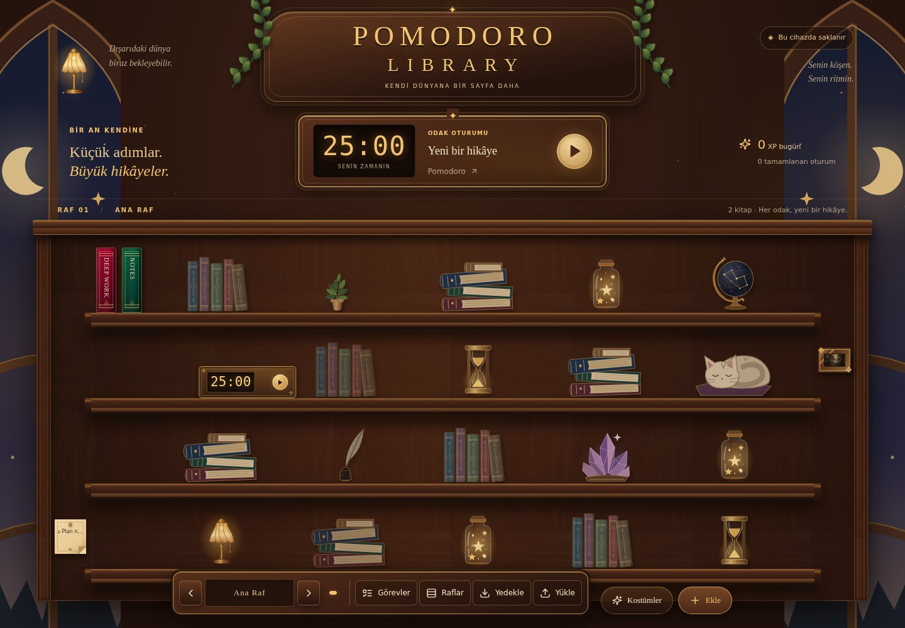
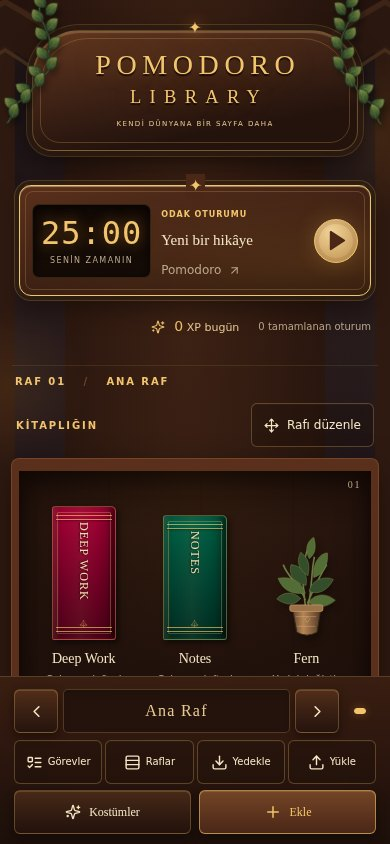
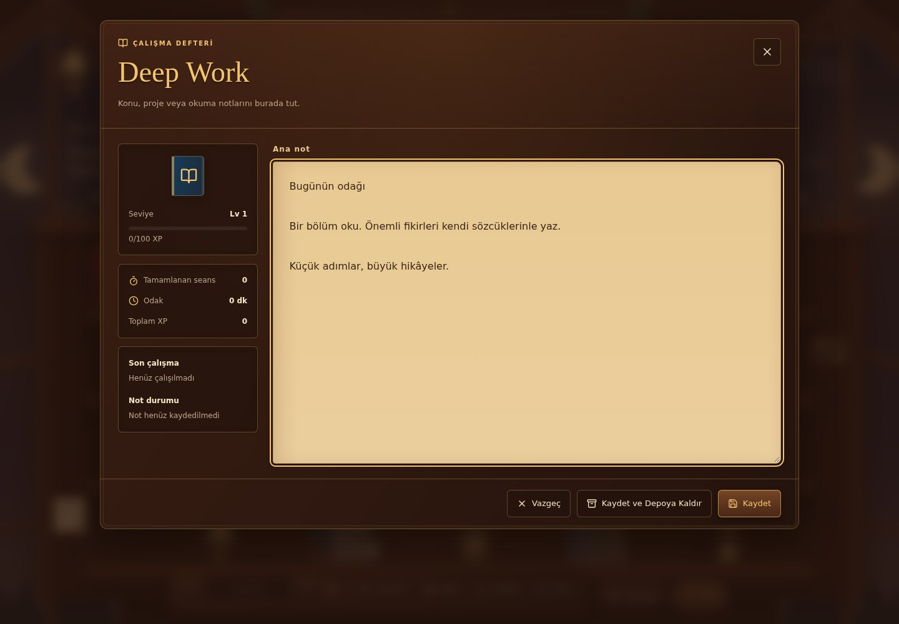

# Kütüphane tasarımı

Ahşap raflar, pirinç çerçeveler, mücevher tonlarında kitaplar ve sıcak ışıklar [#3 tasarım isteğindeki](https://github.com/Kaptankoymat/pomodoro-library-app/issues/3) referansı izler. Sahne, gerçek düğmeler ve bağımsız CSS/SVG katmanlarından oluşur.

## Bileşenler

| Dosya | Sorumluluk |
| --- | --- |
| `src/styles/library-tokens.css` | Palet, türetilmiş ahşap/pirinç malzemeleri, yazı tipleri, aralıklar ve ortak düğme/panel/alan stilleri |
| `src/components/library/LibraryAtmosphere.tsx` | Pencereler, sarmaşıklar, lambalar, kitap yığınları ve diğer dekoratif SVG'ler |
| `src/components/library/LibraryItemVisual.tsx` | Kitap, sayaç, bitki, tablo ve görev notunun görünümü; mevcut kostüm katmanları |
| `src/components/library/ShelfScene.tsx` | Masaüstü rafları ve mevcut sürükleme/çakışma/yer değiştirme davranışları |
| `src/components/library/MobileLibraryScene.tsx` | Telefon/tablet rafları ve klavyeyle de kullanılabilen yerleştirme penceresi |
| `src/components/library/FocusDock.tsx` | Aynı odak oturumunu yöneten büyük saat, başlat/duraklat düğmesi ve ilerleme bilgisi |
| `src/components/library/LibraryNavigation.tsx` | Raf seçimi/adı, görevler, raf yönetimi ve yedek kontrolleri |
| `src/components/library/{AddMenu,TaskModal,WardrobePanel}.tsx` | Ekleme, görev ve kostüm arayüzleri |
| `src/styles/library-{scene,ornaments,mobile,dialogs,surfaces}.css` | Sahne ve yüzeylerin ayrı görünüm katmanları |

`LibraryGrid` mevcut durum, kayıt ve eylem akışlarını koordine eder. Sayaç oturumları, XP/ödüller, notlar, görevler, kostümler, arşiv, raflar ve yedekleme aynı veri modelini ve IndexedDB işlemlerini kullanır. Yeni bağımlılık veya rota eklenmedi; tek ana rota ve kullanılan tüm pencereler yeniden tasarlandı.

## Duyarlı yerleşim ve erişilebilirlik

900px ve altında kitaplar okunabilir, üst üste gelen raf bölümlerinde gösterilir. Rafı düzenle düğmesi, masaüstü sürüklemesiyle aynı yerleştirme kurallarını kullanan bir form açar. Ekran boyutunu değiştirmek kayıtlı konumları değiştirmez.

Dekorasyonlar klavye odağı veya tıklama almaz; masaüstünde gerçek nesnelerin kapladığı alanlarda gizlenir. Eski `wood_texture.png` yalnızca ahşap dokusu olarak yeniden kullanılır. Kostüm PNG'leri korunur; referans görseli uygulamanın arka planı olarak kullanılmaz.

Pencereler tarayıcının modal katmanını, odak yönetimini ve kaydedilmemiş notların kapanma kontrolünü korur. Masaüstünden telefona geçerken kapatılan pencere aynı kitaba odak döndürür. Raf göstergeleri, çok sayıda rafta alt çubuğu büyütmeyen bir kaydırma alanındadır. Animasyonlar `prefers-reduced-motion` tercihini izler.

## Doğrulama

`npm run check` birim testlerini, ESLint'i, TypeScript'i ve üretim derlemesini çalıştırır. `npm run test:e2e` üretim sunucusunda Chromium testlerini çalıştırır. Yeni tarayıcı kapsamı 320, 390, 768, 900, 1366, 1440, 1920 ve 2560px yerleşimlerini; mobil düzenleme ve kostümleri; ortak saat kontrollerini; klavyeyle eklemeyi; pencere odak dönüşünü ve 120 raflık gezinmeyi içerir.

## Görüntüler

Üretim derlemesinden, başlangıç kütüphanesiyle alınan görüntüler:

